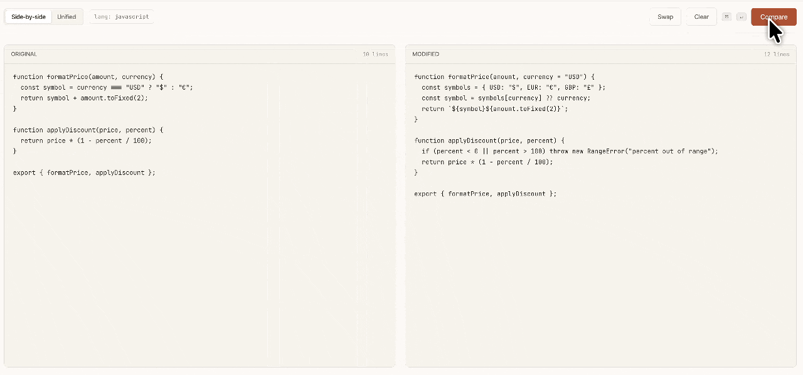

# Differio

> A focused diff checker that respects your time. Paste two texts, get the diff. No accounts, no ads, no upsell.

<p align="center">
  
</p>

## What it is

Differio is a minimal, editorial-feeling diff tool. Paste an original and a modified snippet — get a side‑by‑side or unified diff with syntax coloring, language auto‑detect, and a shareable shortlink. Everything runs in the browser; nothing leaves your machine until you hit *Share*.

## Features

- **Side‑by‑side & unified views** — one keystroke apart.
- **Line‑level LCS diff engine** — accurate add/delete/keep ops with stable line numbers.
- **Language auto‑detect** — TypeScript, JavaScript, JSON, SQL, Python, YAML, Markdown.
- **Syntax highlighting** — warm, desaturated token palette that lives in harmony with the UI.
- **Shareable shortlinks** — deterministic hash of the inputs, with optional expiry.
- **Keyboard‑first** — `⌘↵` (or `Ctrl↵`) to compare.
- **Warm editorial design** — cream palette, Fraunces serif headlines, JetBrains Mono for code. Dark‑mode CSS variables ready to wire up.
- **Local persistence** — your last diff and view choice survive a refresh.

## Tech stack

- [Next.js 15](https://nextjs.org/) (App Router)
- React 18
- TypeScript
- No UI framework — hand‑rolled styles with CSS variables

## Getting started

```bash
# install
npm install

# dev server at http://localhost:3000
npm run dev

# production build
npm run build
npm start
```

## Project structure

```
app/
  layout.tsx        # fonts + metadata
  page.tsx          # screen state machine (landing ↔ tool ↔ result)
  globals.css       # palette, typography, component primitives
components/
  Landing.tsx       # hero + live diff preview + features
  Tool.tsx          # two-pane paste UI with control bar
  Result.tsx        # diff views + summary chip + share popover
  ViewToggle.tsx    # side-by-side / unified switch
  Highlight.tsx     # token-colored line renderer
lib/
  diff.ts           # LCS line diff, tokenizer, language detection
```

## Roadmap / next steps

- [ ] **Dark mode toggle** — the CSS variables already exist under `[data-theme="dark"]`; surface a toggle in the nav and persist it.
- [ ] **Real shortlink backend** — replace the client‑side hash with a server route (Vercel KV or Postgres) that stores the diff and honors expiry.
- [ ] **Word‑level intra‑line diff** — highlight changed tokens inside a changed line, not just the line itself.
- [ ] **More languages** — extend the tokenizer (Rust, Go, CSS) and detection heuristics.
- [ ] **File upload / drag & drop** — drop two files to diff them directly.
- [ ] **Permalink routing** — `/d/[code]` route that hydrates from the backend.
- [ ] **Tests** — unit tests for `diffLines`, `detectLanguage`, and `pairOps`; a couple of Playwright smoke tests for the three screens.
- [ ] **Accessibility pass** — keyboard navigation in the share popover, ARIA roles for the view toggle, contrast audit for both themes.
- [ ] **Deploy** — ship to Vercel and wire up a custom domain.

## Credits

Design handed off from [Claude Design](https://claude.ai/design). Implementation by [@berkinduz](https://github.com/berkinduz).

## License

MIT
